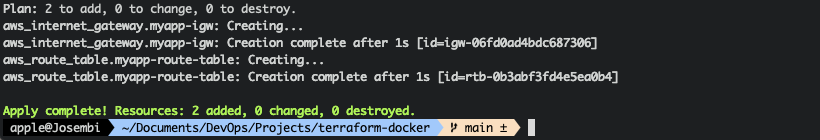

# Docker Container with Terraform

## Introduction

I will be provisioning an EC2 instance on AWS infrastructure, subsequent to which I will run a Docker container in the EC2 instance and deploy an nginx server using Terraform. Just a simple infrastructure with only a VPC and a subnet to simulate a simple web application deployment with a webserver.

Stack preparation:
1. VPC
2. 1 Subnet
3. Route Table & Internet Gateway
   * To allow internet connectivity
4. Provision EC2 instance
5. Deploy **nginx** Docker container
6. Create **Security Group** (Firewall)

## VPC and Subnet

Creation of the VPC and subnet.

```terraform
resource "aws_vpc" "myapp-vpc" {
  cidr_block = var.vpc_cidr_block
  tags = {
    Name : "${var.env_prefix}-vpc"
  }
}

resource "aws_subnet" "myapp-subnet-1" {
  vpc_id     = aws_vpc.myapp-vpc.id
  cidr_block = var.subnet_cidr_block
  tags = {
    Name : "${var.env_prefix}-subnet-1"
  }
}
```

## Internet Gateway and Route Table

An **internet gateway** is a horizontally scaled, redundant, and highly available VPC component that allows communication between your VPC and the internet.

An internet gateway serves two purposes: 

1. Provision of a target in the VPC route table for internet-routable traffic.
2. To perform network address translation (NAT) for instances that have been assigned public IPv4 addresses. Ipv6 addresses are now supported.

A **route table** contains a set of rules, called routes, that are used to determine where network traffic from your subnet or gateway is directed. 

```terraform
resource "aws_route_table" "myapp-route-table" {
  vpc_id = aws_vpc.myapp-vpc.id

  route {
    cidr_block = "0.0.0.0/0"
    gateway_id = aws_internet_gateway.myapp-igw.id
  }
  tags = {
    Name : "${var.env_prefix}-rtb"
  }
}

resource "aws_internet_gateway" "myapp-igw" {
  vpc_id = aws_vpc.myapp-vpc.id

  tags = {
    Name : "${var.env_prefix}-igw"
  }
} 
```



